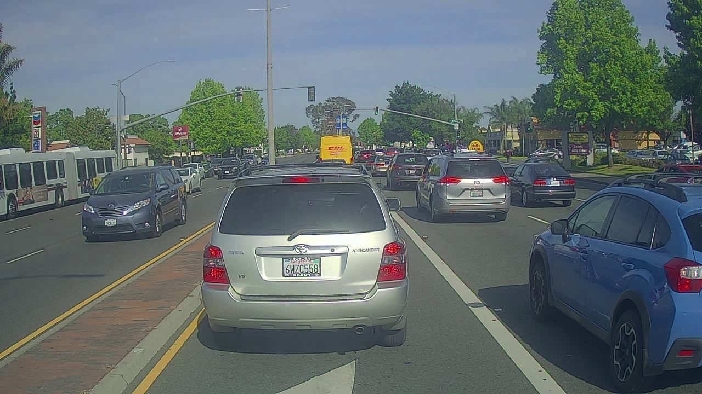
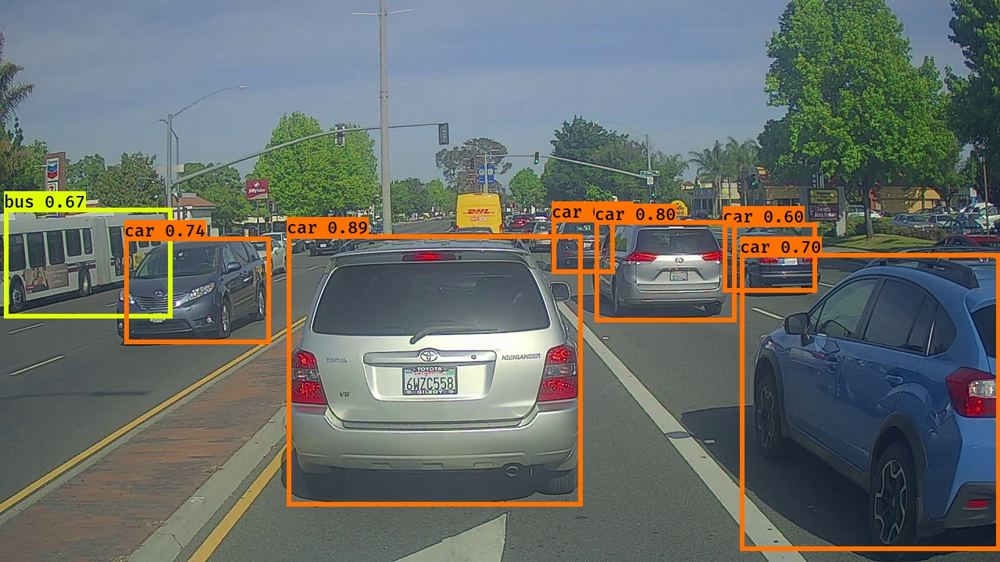

# Object-dectection
Given an image this will detect and classify objects using bounding boxes
# Results
Input image:

Output image:

# Note
1. This project uses existing pretrained weights from the official YOLO website, and further processed using a function written by Allan Zelener.
2. Input images can be found in images directory. Corresponding output images can be found in out directory.
